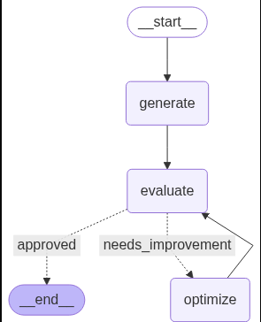
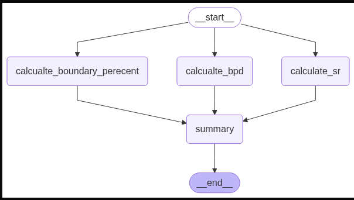
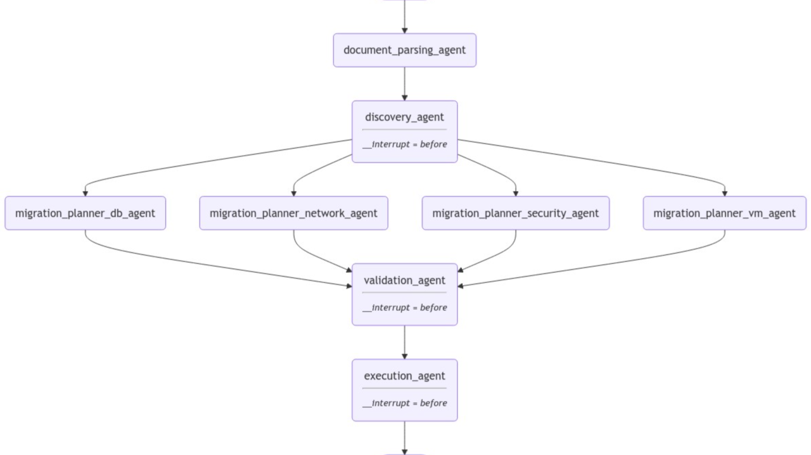

<p align="left">
  
</p>


## 🚀 LangGraph: Building LLM-Powered Agents

[](https://jupyter.org/)
[](https://www.python.org/)
[](https://github.com/sifanmomin1/langgraph/pulls)

> **Unlock the power of Language Models through interactive, modular workflows—right in your browser.**

---

## ✨ What is LangGraph?

**LangGraph** is an open-source Python library built on top of LangChain that enables the creation of complex, stateful, and cyclic workflows for AI agents—especially those powered by Large Language Models (LLMs).  

It uses a **graph-based architecture** to model agent behavior, offering more flexible, dynamic, and reusable execution flows than traditional linear pipelines.  


**Key Capabilities:**
- 🤖 Agentic Reasoning  
- 🔁 Iterative Prompting & Refinement  
- 🔗 Prompt Chaining  
- ⚡ Parallel Inference  
- 🔀 Conditional Routing  
- 🧠 Persistent Memory (RAM-like state management)

---

## 🧩 How LangGraph Works

LangGraph represents workflows as **directed graphs**, where:
- **Nodes:** Define LLM calls, tools, or decision logic  
- **Edges:** Define the data flow between steps  
- **Loops:** Enable retry/iteration until a condition is met  

### Example 1: Sequential + Conditional Workflow

This workflow starts with content generation, then evaluates the result:
- If **approved**, it ends the process.  
- If **needs improvement**, it optimizes and sends the result back to evaluation (loop).

<p align="center">
  
</p>

---

### Example 2: Parallel Evaluation Workflow

Here, multiple evaluators (analysis, language, thought) run **in parallel**. Their results feed into a final evaluation step before the workflow ends.

<p align="center">
  
</p>

---

### Example 3: Full Graph Overview

This diagram shows a complete workflow that mixes **parallel, sequential, and conditional flows**, showcasing how LangGraph can combine complex patterns.

<p align="center">
  
</p>

---

## 📚 What I Learned with LangGraph

Working on this repo helped me understand:

1. **Graph-based agent orchestration:** how to design AI workflows as reusable graph structures  
2. **LLM memory management:** building agents that can remember context beyond a single request  
3. **Parallelization:** running multiple LLM tasks concurrently for performance gains  
4. **Error handling & retries:** using loops and conditional routing to handle unexpected model output  
5. **Integrating LangChain tools:** leveraging existing chains/tools directly inside LangGraph nodes  

> LangGraph isn’t just a toy – it’s a framework to scale up LLM workflows beyond simple sequential chains.

---

## 🗂️ Notebook Catalog

| Notebook | Description |
|----------------------------|------------------------------------------------------------------|
| `bmi.ipynb` | Calculate BMI using code logic and LLM reasoning |
| `customer_sentiment.ipynb` | Analyze customer feedback sentiment using LLMs |
| `llm_workflow.ipynb` | Build modular agent workflows and evaluate their output |
| `parallel.ipynb` | Run concurrent prompt chains for faster results |
| `prompt_chaining.ipynb` | Train LLMs for multi-step reasoning and chaining |
| `quadratic.ipynb` | Solve quadratic equations using LLMs as solvers |
| `uspc.ipynb` | Explore a user-defined structured process chain |
| `x_post.ipynb` | Advanced post-processing and formatting with agents |
| `chatbot.ipynb` | Build an interactive LLM-powered chatbot using LangGraph & LangChain (with RAM-like memory) |

---

## 🌟 Why Use LangGraph?

✅ **Modular Design** – Swap, link, or loop your agent blocks with ease  
✅ **Jupyter First** – Explore everything interactively  
✅ **Educational** – Great for learning real LLM engineering concepts  
✅ **Practical** – Build real-world AI agent workflows in hours  

---

## 🚀 Getting Started

```bash
git clone https://github.com/sifanmomin1/langgraph.git
cd langgraph
python -m venv venv
source venv/bin/activate  # Windows: venv\Scripts\activate
pip install -r requirements.txt
jupyter notebook
